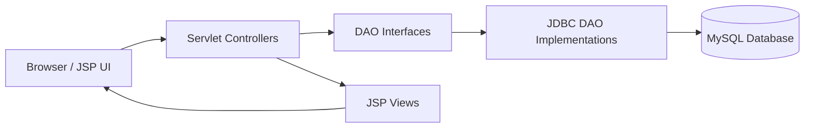

# Cartiva - Grocery Ecommerce Web Application

Cartiva is a full-stack grocery ecommerce web application built with Java Servlets, JSP, JDBC, MySQL, Bootstrap, CSS, and vanilla JavaScript. It provides a polished customer shopping flow and an admin dashboard for managing products, orders, reviews, customers, and stock.

## Project Overview

Cartiva is designed as an internship-ready MVC project that demonstrates practical ecommerce workflows:

- Customers can browse groceries, filter products, manage cart and wishlist, place orders, subscribe to dairy products, and review delivered purchases.
- Admins can manage products, monitor orders, view reviews, track customers, inspect revenue, and handle low-stock items.
- The application follows a servlet-controller, DAO, model, and JSP-view structure for clear separation of concerns.

## Features

- User registration, login, logout, profile, and password reset
- Product listing with search, sorting, filtering, and pagination
- Product details with rating summary and review listing
- Cart management with AJAX add-to-cart feedback
- Wishlist toggle support
- Order placement and order status tracking
- Dairy product subscriptions with quantity and frequency controls
- Verified purchase review system
- Owner-only review editing with Bootstrap modal and AJAX updates
- Admin dashboard with summary sections
- Admin product, order, customer, review, revenue, and low-stock management
- Responsive Bootstrap-compatible UI
- Toast notifications, loading spinners, skeleton loading states, and smooth transitions

## Screenshots

Add screenshots in this section before submission:

```text
docs/screenshots/home.png
docs/screenshots/products.png
docs/screenshots/product-details.png
docs/screenshots/cart.png
docs/screenshots/orders.png
docs/screenshots/admin-dashboard.png
```

Suggested GitHub markdown:

```md


```

## Tech Stack

| Layer | Technology |
| --- | --- |
| Backend | Java Servlets |
| Views | JSP |
| Database Access | JDBC DAO pattern |
| Database | MySQL |
| Frontend | HTML, CSS, Bootstrap 5, JavaScript |
| Charts | Chart.js |
| Architecture | MVC |

## Installation Steps

1. Clone or download the project.

2. Open the project in Eclipse, IntelliJ IDEA, or another Java web IDE.

3. Configure Apache Tomcat with Jakarta Servlet support.

4. Add the MySQL connector JAR if it is not already available:

```text
src/main/webapp/WEB-INF/lib/mysql-connector-j-9.7.0.jar
```

5. Configure database credentials using environment variables:

```text
CARTIVA_DB_URL=jdbc:mysql://localhost:3306/cartiva?useSSL=false&allowPublicKeyRetrieval=true&serverTimezone=UTC
CARTIVA_DB_USER=root
CARTIVA_DB_PASSWORD=your_password
```

If environment variables are not set, the app falls back to the local development values in `DBConnection.java`.

6. Deploy the application on Tomcat.

7. Open the app:

```text
http://localhost:8080/Cartiva
```

## Database Setup

1. Create the database:

```sql
CREATE DATABASE cartiva;
USE cartiva;
```

2. Create the required tables for users, products, cart, wishlist, orders, order items, subscriptions, and reviews.

3. Review-specific SQL is available at:

```text
src/main/resources/sql/create-reviews-table.sql
```

4. Optional production hardening indexes and constraints are available at:

```text
src/main/resources/sql/production-hardening.sql
```

Important review constraint:

```sql
ALTER TABLE reviews
  ADD UNIQUE KEY uq_reviews_user_product (user_id, product_id);
```

This prevents duplicate reviews by the same user for the same product.

## MVC Architecture



### MVC Responsibility Split

- `model`: Plain Java objects such as `User`, `Product`, `Order`, `Review`, and `Subscription`
- `dao`: Interfaces that define database operations
- `dao/impl`: JDBC implementations and SQL queries
- `controller`: Servlets that validate requests, manage sessions, call DAOs, and forward/redirect responses
- `WEB-INF/views`: JSP pages that render customer and admin UI
- `assets/css`: Application styling and responsive UI polish

## Folder Structure

```text
src/main/java/com/cartiva
  controller/
  dao/
  dao/impl/
  filter/
  model/
  util/

src/main/resources/sql/
  create-reviews-table.sql
  production-hardening.sql

src/main/webapp
  assets/css/
  assets/images/
  WEB-INF/views/
  WEB-INF/views/admin/
  WEB-INF/views/partials/

docs/
  FINAL_PROJECT_REPORT.md
```

## Review System

- Users can review only products they purchased and received.
- Review editing is allowed only for the user who created the review.
- The backend verifies ownership using the logged-in session user:

```java
User user = (User) session.getAttribute("user");
existing.getUserId() == user.getUserId();
```

- Review updates use owner-scoped SQL:

```sql
UPDATE reviews
SET rating = ?, comment = ?
WHERE review_id = ? AND user_id = ?;
```

## UI/UX Polish

- Equal-height product cards
- Loading spinners for AJAX buttons
- Skeleton product loading states
- Toast success/error feedback
- Smooth fade-in animations
- Responsive tables and forms
- Stable Bootstrap modal cleanup
- Modern ecommerce-style cards, badges, spacing, and controls

## Future Enhancements

- Add CSRF protection for all state-changing forms
- Add connection pooling with HikariCP
- Add JUnit and Mockito tests for DAO and servlet logic
- Add server-side pagination for large admin tables
- Add product image upload validation
- Add email notifications for order and subscription updates
- Add online payment gateway integration
- Add inventory alerts and automated reorder suggestions
- Add REST APIs for mobile app integration

## Author

**Bhoomika**

Internship Project: Cartiva Grocery Ecommerce Web Application
