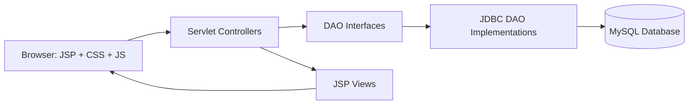
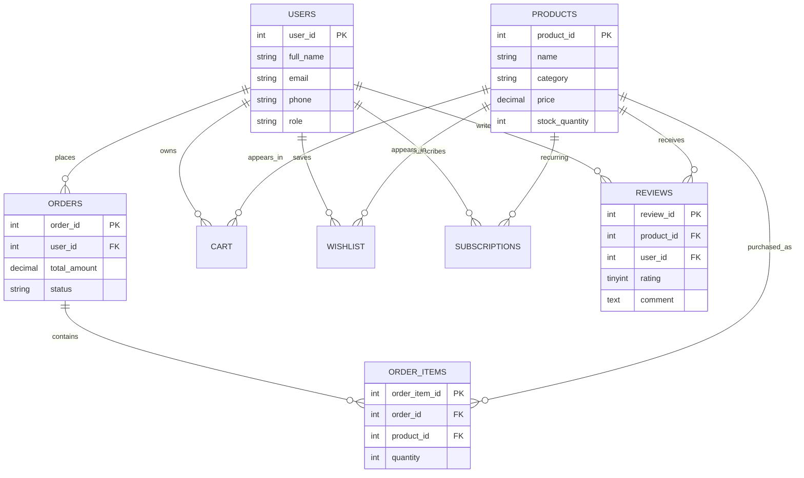

# Cartiva Grocery Web Application

Cartiva is a Java Servlet, JSP, JDBC, and MySQL grocery ecommerce application built with an MVC-style structure. It includes authentication, product browsing, cart, wishlist, orders, subscriptions, reviews, admin management, sorting/filtering, and pagination.

## Final Folder Structure

```text
src/main/java/com/cartiva
  controller/       Servlet request handlers
  dao/              DAO interfaces
  dao/impl/         JDBC DAO implementations
  filter/           Admin access filter
  model/            POJO domain models
  util/             DB and password utilities

src/main/webapp
  assets/css/       Page and global UI styles
  assets/images/    Product and brand images
  WEB-INF/views/    JSP pages
  WEB-INF/views/admin/
  WEB-INF/views/partials/

src/main/resources/sql/
  create-reviews-table.sql
  production-hardening.sql
```

## MVC Architecture



## Responsibilities

JSP pages render UI, form controls, review cards, product cards, admin tables, and Bootstrap modals.

Servlets validate sessions, parse request parameters, enforce authorization, call DAOs, and choose redirects or JSON responses.

DAOs contain SQL and JDBC logic only. They return model objects or success/failure values to the servlet layer.

Models are plain Java objects for products, users, carts, orders, subscriptions, and reviews.

## Database ER Diagram



## Feature List

- Customer registration, login, logout, profile, and password reset.
- Product listing with filters, sorting, pagination, and responsive cards.
- Product details with cart action, subscription action for dairy products, and reviews.
- Cart and wishlist management.
- Order placement and order tracking with status badges.
- Subscription management with aligned controls.
- Verified purchase review creation and owner-only review editing.
- Admin dashboard with users, products, orders, reviews, revenue, and low-stock views.

## Tech Stack

- Java Servlets and JSP for server-rendered MVC.
- JDBC DAO layer for database access.
- MySQL for persistent storage.
- Bootstrap 5, CSS, and vanilla JavaScript for UI.
- Chart.js available for dashboard charts.

## Security And Validation

- Admin pages are protected by `AdminFilter`.
- Sensitive customer actions validate the logged-in session.
- Review editing checks `session.getAttribute("user")`, then compares `user.getUserId()` with the review owner.
- Review update uses prepared statements and owner-scoped SQL.
- Passwords are hashed through `PasswordUtil`.
- Database credentials can be supplied by environment variables:
  - `CARTIVA_DB_URL`
  - `CARTIVA_DB_USER`
  - `CARTIVA_DB_PASSWORD`

## QA Checklist

- Login, logout, register, forgot password.
- Product pagination, sorting, category filters, and invalid product URLs.
- Add to cart, cart quantity changes, checkout, and order creation.
- Wishlist add/remove.
- Subscription create/update/cancel on dairy products.
- Review create/edit, duplicate prevention, owner-only edit, and session expiry.
- Admin dashboard, admin products, admin orders, admin reviews, low stock, and users.
- Mobile layout for product cards, tables, navbar, forms, and modals.

## Future Enhancements

- Add CSRF tokens to all state-changing forms.
- Move remaining SQL constants to centralized query classes or repository methods.
- Add connection pooling through HikariCP.
- Add server-side pagination for admin tables at large scale.
- Add email notifications for order and subscription events.
- Add image upload validation and CDN/object storage support.
- Add JUnit/Mockito tests for DAO and servlet validation paths.
